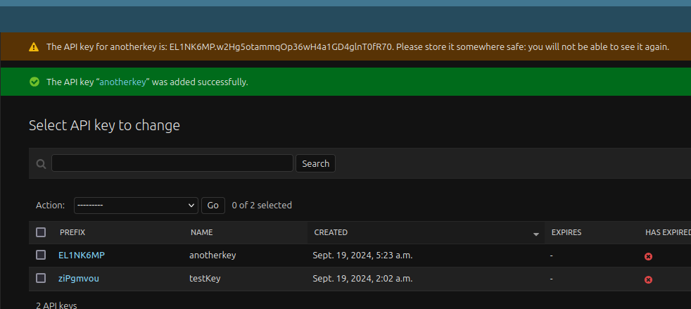

# gamification-tool
Gamification tool is a multi-container application built for Woofya.

## Overview of the Project  

This project is an API tool aiming to provide the Woofya application with gamification features to enhance the user experience on the platform and incentivise users to interact with the main features of the application.    

A simiplified description of the main Woofya application is that it provides features to dog owners based primarily around finding dog-friendly and dog-centric locations and activities for users to share with their pet. 

The API provides extensions to these features through user check-ins, quests, titles, and other gamification and social systems.

Ultimately, through enhanced interaction, this project seeks to incentivise attending these events and fostering more experiences between dog and owner.

The project is comprised of two main parts:  

### 1. An __API tool__ built on Django Rest Framework
The main focus of the project. A dedicated API tool which provides extensibility to the main Woofya application. 

API users are extensions of a Woofya user and only store the user's username along with the gamification aspects provided by the API including points, quests, check-ins by the user, titles, badges, etc.

After entering a username, an API user is created if the username doesn't exist within API database. Currently this is done at the homepage, but if used by the real main application, will need to be either integrated into the main application front end somewhere or possbily ran as a batch to connect the database of current users.  

Users can then access their gamification profile features. The API endpoints only require the username from the main application backend and an application-wide token.  

### 2. A __Reactjs frontend__ for delivering the content. 
The frontend exists to primarily display the user gamification end points and their interactions with the main application. For instance, users will see and interact with their points, have a collection of titles, locations visited, quests active and completed, and have access to a marketplace for spending points.  

Views simulating minimal versions of main application features may be necessary for this project. E.g. Locations to check-in to. However, In the case of integration into the main application, these views would no longer be required, or could possibly be repurposed testing.


## Table of Contents

- [gamification-tool](#gamification-tool)
  - [Overview of the Project](#overview-of-the-project)
    - [1. An __API tool__ built on Django Rest Framework](#1-an-api-tool-built-on-django-rest-framework)
    - [2. A __Reactjs frontend__ for delivering the content.](#2-a-reactjs-frontend-for-delivering-the-content)
  - [Table of Contents](#table-of-contents)
  - [How to run](#how-to-run)
    - [Project setup](#project-setup)
    - [Setting up the development environment](#setting-up-the-development-environment)
    - [Secrets and environment variables](#secrets-and-environment-variables)
      - [API .env files](#api-env-files)
      - [Frontend .env file](#frontend-env-file)
    - [Building and running the containers](#building-and-running-the-containers)
    - [Stop the container](#stop-the-container)
  - [Setting up and accessing API backend](#setting-up-and-accessing-api-backend)
    - [Script for API testing](#script-for-api-testing)
    - [Test base endpoints](#test-base-endpoints)
    - [Admin access](#admin-access)
    - [User access](#user-access)
    - [Postman](#postman)
      - [For the API](#for-the-api)
  - [Access react webpage](#access-react-webpage)
    - [Authorization](#authorization)
  - [Production setup](#production-setup)
    - [Dev and Prod settings and environment variables](#dev-and-prod-settings-and-environment-variables)
    - [Nginx for reverse proxy and serving static content](#nginx-for-reverse-proxy-and-serving-static-content)
    - [Hosting Providers](#hosting-providers)
      - [Digital Ocean droplet hosting](#digital-ocean-droplet-hosting)
      - [AWS RDS PostrgreSQL database](#aws-rds-postrgresql-database)
      - [S3 Static and Media hosting](#s3-static-and-media-hosting)
    - [Running the production build](#running-the-production-build)
    - [What's different in production](#whats-different-in-production)
    - [To do remaining for production](#to-do-remaining-for-production)
  - [Extra command line actions](#extra-command-line-actions)
    - [How to access database:](#how-to-access-database)
    - [How to open a python shell within the docker container:](#how-to-open-a-python-shell-within-the-docker-container)
    - [Testing](#testing)
    - [1. leaderboard testing:](#1-leaderboard-testing)
- [before start:](#before-start)
- [run by default runner:](#run-by-default-runner)
- [test with custom runner:](#test-with-custom-runner)
- [test with one go(combined command, you can directly run this line):](#test-with-one-gocombined-command-you-can-directly-run-this-line)
- [test with one script(there might be permission issue, run the line below first):](#test-with-one-scriptthere-might-be-permission-issue-run-the-line-below-first)
- [by default:](#by-default)
- [or you may wanna run specific test?](#or-you-may-wanna-run-specific-test)
- [or specific class?](#or-specific-class)
- [or specific function?](#or-specific-function)
  - [Project applications](#project-applications)
    - [1. User:](#1-user)
    - [2. Check-in:](#2-check-in)
    - [3. Leaderboard](#3-leaderboard)
    - [4. Marketplace](#4-marketplace)


## How to run

### Project setup  
The applications run in self-managed containers that build based on instructions provided by:
- dockerfiles - specific instructions for running each container
- docker-compose.yml - overall instructions for orchestrating the containers
- requirements.txt - python pip packages used in the Django applications 
- package.json - node modules used by the react front end

For running the containers, nothing else is needed beyond these configurations to build and the code we add.

There are two ways to develop using containers.
1. Develop locally outside of the container, where the purpose of the containers are to package and deploy. For this we need to also build the environment locally to develop locally.
2. Developing inside the container. Using Dev Containers, for example, VS Code provides support for devloping within a container. This is useful for isolating environments - we aren't doing this.

### Setting up the development environment
So how to go about setting up the environment...

1. Install docker compose through Docker Desktop or other means.

2. Create a python virtual environment for our project. This is used to install and manage pip packages specific to the project environment, instead of using the global python version. Requires python installation.

    - This is either done in the root directory i.e. `/gamification-tool` via command line or the easier way through VS Code - [documentation here](https://code.visualstudio.com/docs/python/environments)

3. With the .venv active we can run the following from the `/api` directory to install Django and the other required packages  
`$ python pip install pip install --no-cache-dir -r requirements.txt` 

    - Later, when adding new packages to the api use `$ pip freeze > requirements.txt` from the correct directory to update the file  


1. Build the frontend application locally. This requires nodejs/npm.  
From the `/frontend` directory run `npm install` to build and `npm start` if you want to run the front end as per the `package.json` file instructions.

With this set up, we should be able to begin developing locally. But we can't run everything yet.

### Secrets and environment variables
Each application frontend and api have a `.env` file associated with them. They contain the environment variables and secrets to be used during development. They should be in each separate application's root folder.  

These files are in `.gitignore` so they aren't version controlled meaning we each need to make them separately in dev environments, i.e. our local machines.

Ideally they should be ignored by docker also, but that is more important in the production environment where we can use a hosted secrets manager.  

The .env files excluded from git in the project structure:  
  

#### API .env files
__Important: If updating from an earlier state of the project repo, the .env files are managed slightly differently in that where there was just a single .env for the backend, there are now two. One for dev and one for prod environments__  

As mentioned in the previous sections, we need to make our own .env files as they aren't shared in version control for dev builds.

The pip package python-dotenv should already be installed from the `requirements.txt` earlier. If not, install it.

Here's an example for the Django environment variables in the backend.  
  

The Django Secret key is added to .env instead of having it exposed in the project settings.  
Check the commented SECRET_KEY variable in settings.py to get the values, or generate another for your own dev machine.  

`IS_S3_STORAGE` is a check for whether static and media will be collected in an AWS Bucket, or in the regular `STATIC_ROOT`. It should be false for dev builds, and can be false in the prod build in the case we don't want to use S3.

The dev database user credentials environment variables can be found in `docker-compose.yml` in the project root so just copy them over to your `.env.dev`.  


#### Frontend .env file
The React .env file is handled by the react-scripts library.  
All frontend secrets need to start with `REACT_APP_` to be recognised by React: 

The .env in the `/frontend` directory.  
  
This file contains a new value `REACT_APP_BASE_URL` which replaces the hard-coded domain to allow for dev and production builds.  
__For development we set it as:__ `http://localhost:8000/`  
__For testing production locally we set it as:__ `http://localhost/`  
Actual production uses a different value.  
 
Here's a couple of examples of how to use it in the frontend JS files: 
- `process.env.REACT_APP_BASE_URL + "users/users/";`  
- `axios.get(process.env.REACT_APP_BASE_URL + 'quiz/${quizId}/leaderboard/'`    


### Building and running the containers
If all went to plan we should be able to build and run the containers, albeit without functioning databases yet.  

It may be necessary, and easier, to start fresh with docker containers and volumes at this point.  
The following commands will delete local containers and volumes:  
- For containers: `$ docker rm -f $(docker ps -a -q)`  
- For volumes: `$ docker volume rm $(docker volume ls -q)`  

Devs should delete old migrations too to start with a fresh database schema.  

The above should only be done in a dev environment when there is no data to be lost.  


1. Spin up containers:  
`$ docker-compose up --build`

This builds and runs three containers:
1. frontend
2. api
3. api_db 

Note: These containers can be referenced in terminal by their name.

Also note: Depending on the version of docker compose installation, the general terminal command could either be `$ docker-compose` or `$ docker compose` with the former being the older version.

Note: The React front end won't be able to access the endpoints in our API until we provide an API Key to the frontend client and since environment variables are processed at build time, we can't change the value in the frontend `.env` while it is still running. So the next steps in the *Setting up and accessing API backend* are necessary as we, assuming this is a fresh dev environment, need to migrate a new database to be able to generate and store an API Key and we need an admin user with permissions to generate that key. THis is done before spinning down the containers, updating the frontend `.env` and bringing up the containers again.  

### Stop the container

1. To spin down a container:  
`$ docker-compose down`  
or CTRL+c if the instance is attached to the terminal.

## Setting up and accessing API backend

Every clean build of the containers will require migrations and creation of a super user.

For the API:  
1. `$ docker-compose exec api python manage.py makemigrations`
2. `$ docker-compose exec api python manage.py migrate`  
3. `$ docker-compose exec api python manage.py createsuperuser` and follow the prompts to make an admin  

Subsequent changes to the models will require migrations to update the database.

If the migration isn't working due to a major change to a database table structure i.e. changing the user entity to a customised user entity, either drop the database and start with a fresh migration, nuke the docker containers and volumes, or there are hack ways to comment out some auth sections in the code which will aloow the migration to go through you can find on stackoverflow.

### Script for API testing

There's a python script for creating 100 new users with different score:  
`$ docker-compose exec api python manage.py create_users`

Another script to create points log(if user have no log):  
`$ docker-compose exec api python manage.py create_pointsLog`

Another script to edit friend lists:  
`$ docker-compose exec api python manage.py create_friendlist`
Another script to add quiz:
`$ docker-compose exec api python manage.py create_quiz`


### Test base endpoints

With the docker containers running try the endpoints in browser:

- API: http://localhost:8000/ - should render but doesn't have a registered endpoint
- Frontend - http://localhost:3000/ - should display login page

### Admin access

Admin page can be reached at http://localhost:8000/admin/

### User access
Endpoints are accessible for users but will give `403` responses in the browser due to the API Key being needed in request headers in the API application (localhost:8000).  

### Postman
So that leaves Postman for testing endpoints, curl requests, or any other service in which you can provide the headers for requests.

Current endpoint testing is in this postman collection [here](https://app.getpostman.com/join-team?invite_code=bd83f7113fd74ced7c850f964c050351)

#### For the API
All authorized requests require an API key - Gamification-Api-Key. This is the key that you need to store in the `frontend/.env` file  
  
*Example using the API Key in a Postman request*  
  

This is generated in the admin dashboard as below.
1. Navigate to http://localhost:8000/admin/
2. Add an API key from the *Add* link in the *API KEY PERMISSIONS* section in the example below
  

3. Give it a name, other fields are optional  
4. *SAVE* the key  
  

5. Grab the full key from the banner notification message straight after saving the key. That is the string before the second full stop i.e. `xxxxxxxx.xxxxxxxxxxxxxxxxxxxxxxxxxxxxxxxx`   
**Note: This is the only time you will see the full key. Only the prefix will be available after**  
  

## Access react webpage
Our application frontend can be accessed from http://localhost:3000/

### Authorization

API users are created or retrieved after entering username in the 'login' page.  

The API Key needs to be included in headers for any authorized API request.
This is done through the use of reactscripts native .env file for secrets. 

## Production setup

For splitting the project into develop and production applications, we need to utilise separate settings for the application, as well as use tools to serve the application in a production environment.  

Our production set up follows [this tutorial](https://testdriven.io/blog/dockerizing-django-with-postgres-gunicorn-and-nginx) which utilizes gunicorn as the WGSI server, and Nginx for reverse proxy. 

Currently the setup has the API and database in the production docker-compose with the front-end having to be built separately.

So let's get into the details.  

### Dev and Prod settings and environment variables

We now have two docker-compose.yml files:  
- `docker-compose.yml` - for building our local development environment
- `docker-compose.prod.yml` - for building our production environment

The dev setup of the environment variables was detailed in the earlier section *API.env files*, but we will include it here also.  

Settings in the Django project which require differences between environments are stored in .env files in the project root and are imported into the docker-compose.yml's and Django. The files are:  
- .env.dev - for develop environment (the same one)  
  

- .env.prod  
  

- .env.prod.db  
  

- .env in /frontend (the same one)
  
This file contains a new value `REACT_APP_BASE_URL` which replaces the hard-coded domain to allow for dev and production builds.  
__For development we set it as:__ `http://localhost:8000/`  
__For testing production locally we set it as:__ `http://localhost/`  
Actual production uses a different value.  
 
Here's a couple of examples of how to use it in the frontend JS files: 
- `process.env.REACT_APP_BASE_URL + "users/users/";`  
- `axios.get(process.env.REACT_APP_BASE_URL + 'quiz/${quizId}/leaderboard/'`    


(Note: The above are placehoder env values)

### Nginx for reverse proxy and serving static content
Nginx contains both a config file, and a Dockerfile as it is part of the production docker-compose build.  

  

At this point, Nginx is providing a reverse proxy service to the API, where requests are sent to Nginx at port 1337, which it forwards to the actual application.

The static from the Django project are served in the locations specified by the config file which corresponds to volumes created in `docker-compose.prod.yml`.

### Hosting Providers
We won't provide any detailed information about the providers here, but an overview of what services the project uses for hosting and backing up data.
#### Digital Ocean droplet hosting
This application is run using Docker orchestration to build the API, and a reverse proxy using nginx to serve it in a single Digital Ocean droplet. The containers are built and spun up from the `docker-compose.prod.yml` in this repo, and `Dockerfile.prod` for the frontend React project, and another separate `Dockerfile` for the Location service.

#### AWS RDS PostrgreSQL database
The production build is connected to a postgreSQL instance in the cloud to offload database management, and for automated backups. Performance can be slower, particularly when retrieving a lengthy list of values than a volumed instance.

#### S3 Static and Media hosting
The application is also connected to an S3 instance for hosting the static and media files. The django manage command `collectstatic` detailed below updates the static content direct to the bucket. User media is saved to the bucket when that content is posted.   
  

There is an option to return to the Docker volume-served content by altering the `.env.prod` file environment variable `IS_S3_STORAGE` to `FALSE`.

### Running the production build
The following tasks need to be run whenever the production container is being built:  
1. Building and running in a detached instance:  
`$ docker compose -f docker-compose.prod.yml up -d --build`  

2. Migrating the models to the database:  
`$ docker compose -f docker-compose.prod.yml exec api python manage.py migrate --noinput`  

3. Collecting static for the project, including media:  
`$ docker compose -f docker-compose.prod.yml exec api python manage.py collectstatic --no-input --clear`  

4. Creating the superuser as before:  
`$ docker compose -f docker-compose.prod.yml exec api python manage.py createsuperuser`  

Steps 5-8 are production build commands within the scope of the project so there is some populated data. Note: the quiz feature needs to be populated with questions otherwise it won't run:  

5. Create dummy users (This is part of the production build for the scope of this project):  
`$ docker compose -f docker-compose.prod.yml exec api python manage.py create_users`

6. Add Points logs if necessary:  
`$ docker compose -f docker-compose.prod.yml exec api python manage.py create_pointsLog`

7. Build friendlists:  
`$ docker compose -f docker-compose.prod.yml exec api python manage.py create_friendlist`

8. Populate quiz database:  
`$ docker compose -f docker-compose.prod.yml exec api python manage.py create_quiz`

9. Generate a new API-Key for the frontend from the Admin dash:  
Accessible at http://api.gamificationtool.xyz/admin/  

10. Add the API-Key to the frontend .env file as before  

11. Build and run the front end dockerfile on the usual port. Manually is easier since the .env files are processed at build time, we can't build the ReactJS container until we get the API Key from the API.

    From the root directory we build the frontend container and tag it as frontend:  
`$ docker build -f Dockerfile.prod -t frontend-image ./frontend`  

    Then we run the docker instructions and expose port 3000:  
`$ docker run -d -p 3000:3000 --name frontend-container frontend-image`  

1. Spinning down the containers:  
`$ docker compose -f docker-compose.prod.yml down`  

    We can stop the frontend container with:  
`$ docker stop frontend-container`

    And delete it if need be with:  
`$ docker rm frontend-container`  

Note: When spinning down the develop and production containers (prior to actualy production) it is important to make sure services using the same ports between dev and prod are not both up.

### What's different in production
1. We are no longer using `manage.py run server`. Production uses the Gunicorn command.
2. We have multiple .env's to separate develop and production builds
3. The production Dockerfile `Dockerfile.prod` is multistage and contains a Python linter. So when we build the application, it will raise errors and stop the build process for un-conventioned python code. Build again after fixing the code.
4. The frontend .env has an environment variable to allow for changing URL's based on which build we are going for.
5. All requests are directed to the Nginx proxy server, currently at http://api.gamificationtool.xyz.
6. Frontend is built in production mode
7. Frontend application is using the `serve` package for a simple and essentially config free version of a served application. 

### To do remaining for production
- Implement SSL for secure https protocol of our application
- Backup static, media and database to ensure data integrity

## Extra command line actions

### How to access database:

1. Open connection with postgresql:  
`$ docker-compose exec db psql -U <user> -d <database> --password`
2. Enter postgresql user password when prompted  

Once in:
- View databases: `\l`  
- Connect to database: `\c <database>` - (_should already be connected_)  
- Display tables: `\dt`   
- SQL queries, example: `SELECT * FROM auth_group;`

### How to open a python shell within the docker container:

1. Run bash inside the api container:  
`$docker-compose exec api sh`

2. Open python shell:  
`$python manage.py shell`  
- Or in a one liner:  
`$ docker-compose exec api python manage.py shell`

3. Import class and models from modules, save to db, etc.:
```
>>> from check_in.models import Location, Event
>>>from django.utils import timezone
>>> l = Location(location_name="Here", date_visited=timezone.now())
>>> l.save()
>>> l.id
```

### Testing
Unit tests are made in each app under tests.py

1. To run tests:  
`$ python manage.py test <app name>`

View testing requires using the python shell under test environment conditions. Look at Django tutorial part 5 in the documentation: [here](https://docs.djangoproject.com/en/5.1/intro/tutorial05/)

### 1. leaderboard testing: 

# before start:
docker-compose down --volumes --remove-orphans

# run by default runner:
docker-compose run api python manage.py test leaderboard.tests --noinput -v 2

# test with custom runner:

docker-compose run api python manage.py test leaderboard.tests --testrunner=custom_test_runner.CustomTestRunner --noinput -v 2

# test with one go(combined command, you can directly run this line):
docker-compose down --volumes --remove-orphans; Start-Sleep -Seconds 5; docker-compose run api python manage.py test leaderboard.tests --noinput -v 2

# test with one script(there might be permission issue, run the line below first):
Set-ExecutionPolicy -ExecutionPolicy RemoteSigned -Scope CurrentUser

# by default: 

.\run_tests.ps1

# or you may wanna run specific test? 

.\run_tests.ps1 -TestPath "leaderboard.tests.test_edge_cases"

# or specific class? 

.\run_tests.ps1 -TestPath "leaderboard.tests.test_edge_cases.LeaderboardEdgeCasesTests"

# or specific function? 
.\run_tests.ps1 -TestPath "leaderboard.tests.test_edge_cases.LeaderboardEdgeCasesTests.test_leaderboard_with_boundary_dates"

## Project applications
### 1. User: 
Custom user implementation built on top of Django users.
On top of the base implementation each user has:
- Total points
- Spendable points
- Level
- VIP user (a bool indicating a high contributor o Woofya)
- Avatar, which is either:
    - An uploaded image by the user
    - Or a cartoon representation of the user
- Lists of:
    - Dog entities
        - May contain their own avatar, cosmetics, etc.
    - Milestones (FK)
    - Titles (FK)
    - Badges (FK)
    - Any other cosmetics (FK)
    - locations visited (FK)
    - events visited (FK)

### 2. Check-in: 
Application for handling location and event check-ins.
Contains models for:
- Location
- Event

### 3. Leaderboard
Application for handling the user points leaderboard.

Depending on the implementations, leaderboard could be used for:
- Points accumulated over time
- Locations visited
- Measure related to their pets - e.g. distance walked, for example

### 4. Marketplace
Application for handling points-spending activities. Acts as not only the shop, but also the database to view all available items, purchaseable or not.

Contains:
- Shop
- Entities:
    - Badges
    - Titles
    - Milestones (_unsure if this should be here or in the user app_)
    - Any other cosmetics
