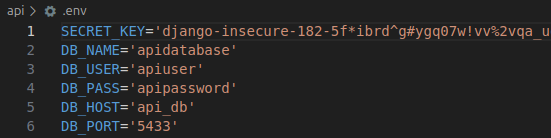
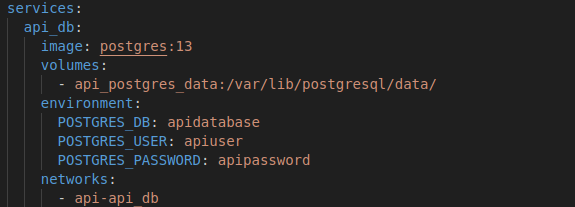

# gamification-tool
Gamification tool is a multi-container application built for Woofya.

## Overview of the Project  

This project is an API tool aiming to provide the Woofya application with gamification features to enhance the user experience on the platform and incentivise users to interact with the main features of the application.    

A simiplified description of the main Woofya application is that it provides features to dog owners based primarily around finding dog-friendly and dog-centric locations and activities for users to share with their pet. 

The API provides extensions to these features through user check-ins, quests, titles, and other gamification and social systems.

Ultimately, through enhanced interaction, this project seeks to incentivise attending these events and fostering more experiences between dog and owner.

The project is comrised of three main parts:

### 1. An __API tool__ built on Django Rest Framework
The main focus of the project. A dedicated API tool which provides extensibility to the main mocked Woofya application described below. 

API users are extensions of a Woofya user and only store the user's username along with the gamification aspects provided by the API including points, quests, check-ins by the user, titles, badges, etc.

After users login via the mock woofya site, an API user is created if the username doesn't exist within API database. Currently this is done at the mock homepage, but if used by the real main application, will need to be either integrated into the main application front end somewhere or possbily ran as a batch to connect the database of current users.  

Users can then access their gamification profile features. The API endpoints only require the username from the main application backend and an application-wide token.

### 2. A __Web backend__ mock Woofya built to simulate the real application, also delivered through a Django REST application.
This is the part of the project simulating the main Woofya application. For this project's purposes it should contain the main application users, locations, events - any relevant features of the main Woofya application the API needs to interact with.  

Implementations in the web backend need only be minimal. Users only need credentials, for instance. And views for locations to check in to only need to show the API functionality. As such, there is no need to worry about making forms in the front end for creating, updating or deleting these entities. Posting directly to the endpoint, using the admin dashboard, or using some database initialiser is suitable enough.  

Integration into the main application in production would remove the need for this backend, replacing the endpoints with those used by Woofya.


### 3. A __Reactjs frontend__ for delivering the content. 
The frontend exists to primarily display the user gamification end points and their interactions with the main application. For instance, users will see and interact with their points, have a collection of titles, locations visited, quests active and completed, and have access to a marketplace for spending points.  

Views simulating minimal versions of main application features are necessary for this project. E.g. Locations to check-in to. However, In the case of integration into the main application, these views would no longer be required, or could possibly be repurposed testing.


## Table of Contents

- [gamification-tool](#gamification-tool)
  - [Overview of the Project](#overview-of-the-project)
    - [1. An __API tool__ built on Django Rest Framework](#1-an-api-tool-built-on-django-rest-framework)
    - [2. A __Web backend__ mock Woofya built to simulate the real application, also delivered through a Django REST application.](#2-a-web-backend-mock-woofya-built-to-simulate-the-real-application-also-delivered-through-a-django-rest-application)
    - [3. A __Reactjs frontend__ for delivering the content.](#3-a-reactjs-frontend-for-delivering-the-content)
  - [Table of Contents](#table-of-contents)
  - [How to run](#how-to-run)
    - [Project setup](#project-setup)
    - [Setting up the development environment](#setting-up-the-development-environment)
    - [Secrets and environment variables](#secrets-and-environment-variables)
      - [Web and API .env files](#web-and-api-env-files)
      - [Frontend .env file](#frontend-env-file)
    - [Building and running the containers](#building-and-running-the-containers)
    - [Stop the container](#stop-the-container)
  - [Setting up and accessing Web backend and API](#setting-up-and-accessing-web-backend-and-api)
    - [Script for API testing](#script-for-api-testing)
    - [Test base endpoints](#test-base-endpoints)
    - [Admin access](#admin-access)
    - [User access](#user-access)
    - [Postman](#postman)
      - [For the API](#for-the-api)
      - [For the Web backend](#for-the-web-backend)
  - [Access react webpage](#access-react-webpage)
    - [Authorization](#authorization)
  - [Extra command line actions](#extra-command-line-actions)
    - [How to access database:](#how-to-access-database)
    - [How to open a python shell within the docker container:](#how-to-open-a-python-shell-within-the-docker-container)
    - [Testing](#testing)
- [Project applications](#project-applications)
  - [1. User:](#1-user)
  - [2. Check-in:](#2-check-in)
  - [3. Leaderboard](#3-leaderboard)
  - [4. Marketplace](#4-marketplace)


## How to run

### Project setup  
The applications run in self-managed containers that build based on instructions provided by:
- dockerfiles - specific instructions for running each container
- docker-compose.yml - overall instructions for orchestrating the containers
- requirements.txt - python pip packages used in the Django applications 
- package.json - node modules used by the react front end

For running the containers, nothing else is needed beyond these configurations to build and the code we add.

There are two ways to develop using containers.
1. Develop locally outside of the container, where the purpose of the containers are to package and deploy. For this we need to also build the environment locally to develop locally.
2. Developing inside the container. Using Dev Containers, for example, VS Code provides support for devloping within a container. This is useful for isolating environments - we aren't doing this.

### Setting up the development environment
So how to go about setting up the environment...

1. Install docker compose through Docker Desktop or other means.

2. Create a python virtual environment for our project. This is used to install and manage pip packages specific to the project environment, instead of using the global python version. Requires python installation.

    - This is either done in the root directory i.e. `/gamification-tool` via command line or the easier way through VS Code - [documentation here](https://code.visualstudio.com/docs/python/environments)

3. With the .venv active we can run the following from the `/web` and `/api` directories to install Django and the other required packages  
`$ python pip install pip install --no-cache-dir -r requirements.txt` 

    - Later, when adding new packages to the web backend or api use `$ pip freeze > requirements.txt` from the correct directory to update the file  


4. Build the frontend application locally. This requires nodejs/npm.  
From the `/frontend` directory run `npm install` to build and `npm start` if you want to run the front end as per the `package.json` file instructions.

With this set up, we should be able to begin developing locally. But we can't run everything yet.

### Secrets and environment variables
Each application frontend, web and api have a `.env` file associated with it. It contains the environment variables and secrets to be used during development. They should be in each separate application's root folder (frontend, web, api).  

These files are in `.gitignore` so they aren't version controlled meaning we each need to make them separately at the moment.

Ideally they should be ignored by docker also, but that is more important in the production environment where we can use a hosted secrets manager.

The .env files excluded from git in the project structure:    


#### Web and API .env files
We need to make our own .env files.  

The pip package python-dotenv should already be installed from the `requirements.txt` earlier. If not, install it.

Here's the example for the Django environment variables in the web backend.
  
The Django Secret key is added to .env. Check the commented SECRET_KEY variable in settings.py for both API and web to get the values.

At the moment the database environment variables can be found in `docker-compose.yml` in the project root so just copy them over.  
 

Do the same for the API .env

#### Frontend .env file
The React .env file is handled by the react-scripts library.  
All frontend secrets need to start with `REACT_APP_` to be recognised by React:   
  
This value should be the API key generated later in the next section.

### Building and running the containers
If all went to plan we should be able to build and run the containers, albeit without functioning databases yet.  

It may be necessary, and easier, to start fresh with docker containers and volumes at this point.  
The following commands will delete local containers and volumes:  
- For containers: `$ docker rm -f $(docker ps -a -q)`  
- For volumes: `$ docker volume rm $(docker volume ls -q)`  

Devs should delete old migrations too to start with a fresh database schema.  

The above should only be done in a dev environment when there is no data to be lost.  


1. Spin up containers:  
`$ docker-compose up --build`

This builds and runs five containers:
1. frontend
2. web
3. api
4. web_db
5. api_db 

Note: These containers can be referenced in terminal by their name.

Also note: Depending on the version of docker compose installation, the general terminal command could either be `$ docker-compose` or `$ docker compose` with the former being the older version.  


### Stop the container

1. To spin down a container:  
`$ docker-compose down`  
or CTRL+c if the instance is attached to the terminal.

## Setting up and accessing Web backend and API

Every clean build of the containers will require migrations and creation of a super user.

For the API:  
1. `$ docker-compose exec api python manage.py makemigrations`
2. `$ docker-compose exec api python manage.py migrate`  
3. `$ docker-compose exec api python manage.py createsuperuser` and follow the prompts to make an admin  

For the web backend  
1. `$ docker-compose exec web python manage.py makemigrations` 
2. `$ docker-compose exec web python manage.py migrate`  
3. `$ docker-compose exec web python manage.py createsuperuser` and follow the prompts again

Subsequent changes to the models will require migrations to update the database.

If the migration isn't working due to a major change to a database table structure i.e. changing the user entity to a customised user entity, either drop the database and start with a fresh migration, nuke the docker containers and volumes, or there are hack ways to comment out some auth sections in the code which will aloow the migration to go through you can find on stackoverflow.

### Script for API testing

There's a python script for creating 100 new users with different score:  
`$ docker-compose exec api python manage.py create_users`

Another script to create points log(if user have no log):  
`$ docker-compose exec api python manage.py create_pointsLog`

### Test base endpoints

With the docker containers running try the endpoints in browser:

- Web: http://localhost:8080/ - should render but doesn't have a registered endpoint
- API: http://localhost:8000/ - should render but doesn't have a registered endpoint
- Frontend - http://localhost:3000/ - should display login page

### Admin access

Admin endpoints can be reached at http://localhost:8000/admin/ and http://localhost:8080/admin/ respectively

### User access
The endpoints are accessible by users but not authorized from the browser due to the JWT authorization in the web backend application (localhost:8080) and the API Key in the API application (localhost:8000).  

### Postman
So that leaves Postman for testing endpoints. 

Current endpoint testing is in this postman collection [here](https://app.getpostman.com/join-team?invite_code=bd83f7113fd74ced7c850f964c050351)

#### For the API
All authorized requests require an API key - Gamification-Api-Key. This is the key that you need to store in the `frontend/.env` file  
  

This is generated in the admin dashboard as below.
  

And can be saved only once at the time of creation.
  

#### For the Web backend  
Users are authenticated with JWT tokens.
The post token endpoint generates tokens for a user given their username and password in the request body.  

  

All secured endpoints need to include the bearer token authorization using the access token.
  

## Access react webpage
Our application frontend can be accessed from http://localhost:3000/

### Authorization
Web backend users simulating the real application  log in with their credentials. So you may need to make a user in http://localhost:8080/admin/

Axios handles the access tokens, and refresh tokens of users through an interceptor after login.

The API Key needs to be included in headers for any authorized API request.

This is done through the use of reactscripts native .env file for secrets.

## Extra command line actions

### How to access database:

1. Open connection with postgresql:  
`$ docker-compose exec db psql -U <user> -d <database> --password`
2. Enter postgresql user password when prompted  

Once in:
- View databases: `\l`  
- Connect to database: `\c <database>` - (_should already be connected_)  
- Display tables: `\dt`   
- SQL queries, example: `SELECT * FROM auth_group;`

### How to open a python shell within the docker container:

1. Run bash inside the web container:  
`$docker-compose exec web sh`

2. Open python shell:  
`$python manage.py shell`  
- Or in a one liner:  
`$ docker-compose exec web python manage.py shell`

3. Import class and models from modules, save to db, etc.:
```
>>> from check_in.models import Location, Event
>>>from django.utils import timezone
>>> l = Location(location_name="Here", date_visited=timezone.now())
>>> l.save()
>>> l.id
```

### Testing
Unit tests are made in each app under tests.py

1. To run tests:  
`$ python manage.py test <app name>`

View testing requires using the python shell under test environment conditions. Look at Django tutorial part 5 in the documentation: [here](https://docs.djangoproject.com/en/5.1/intro/tutorial05/)


# Project applications
## 1. User: 
Custom user implementation built on top of Django users.
On top of the base implementation each user has:
- Total points
- Spendable points
- Level
- VIP user (a bool indicating a high contributor o Woofya)
- Avatar, which is either:
    - An uploaded image by the user
    - Or a cartoon representation of the user
- Lists of:
    - Dog entities
        - May contain their own avatar, cosmetics, etc.
    - Milestones (FK)
    - Titles (FK)
    - Badges (FK)
    - Any other cosmetics (FK)
    - locations visited (FK)
    - events visited (FK)

## 2. Check-in: 
Application for handling location and event check-ins.
Contains models for:
- Location
- Event

## 3. Leaderboard
Application for handling the user points leaderboard.

Depending on the implementations, leaderboard could be used for:
- Points accumulated over time
- Locations visited
- Measure related to their pets - e.g. distance walked, for example

## 4. Marketplace
Application for handling points-spending activities. Acts as not only the shop, but also the database to view all available items, purchaseable or not.

Contains:
- Shop
- Entities:
    - Badges
    - Titles
    - Milestones (_unsure if this should be here or in the user app_)
    - Any other cosmetics
